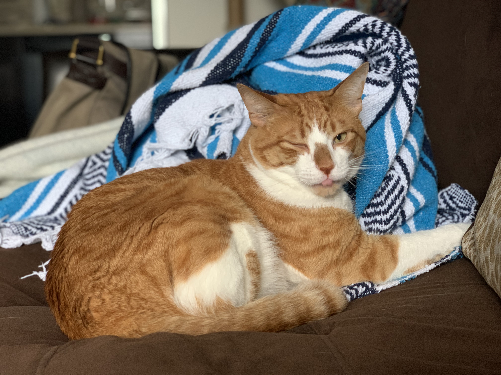
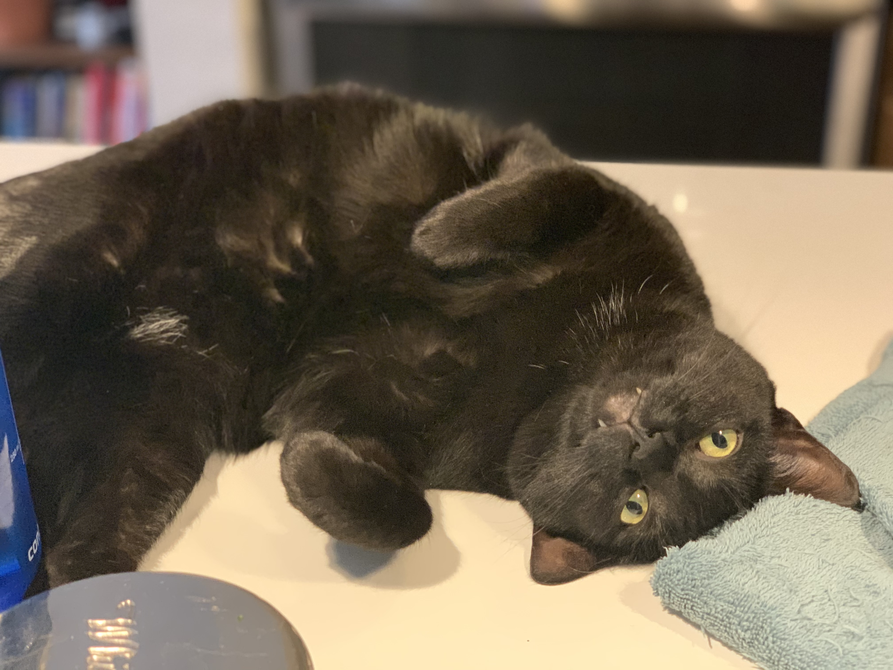

Hey! Thanks for visiting my Github! Read more about me below!

- 👋 Hi, I’m @spaghettiplants
- 👀 I’m interested in cats, food, traveling, math education, and data science for good!
- 🌱 I’m currently learning about unsupervised learning!
- 💞️ I’m looking to collaborate on data science for good projects.
- 📫 Feel free to reach out to me on Twitter! @spaghettiplants

Here are my kitties!

**Miguelito**

**Artemis**

<!---
spaghettiplants/spaghettiplants is a ✨ special ✨ repository because its `README.md` (this file) appears on your GitHub profile.
You can click the Preview link to take a look at your changes.
--->
